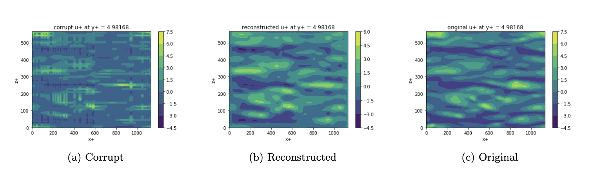
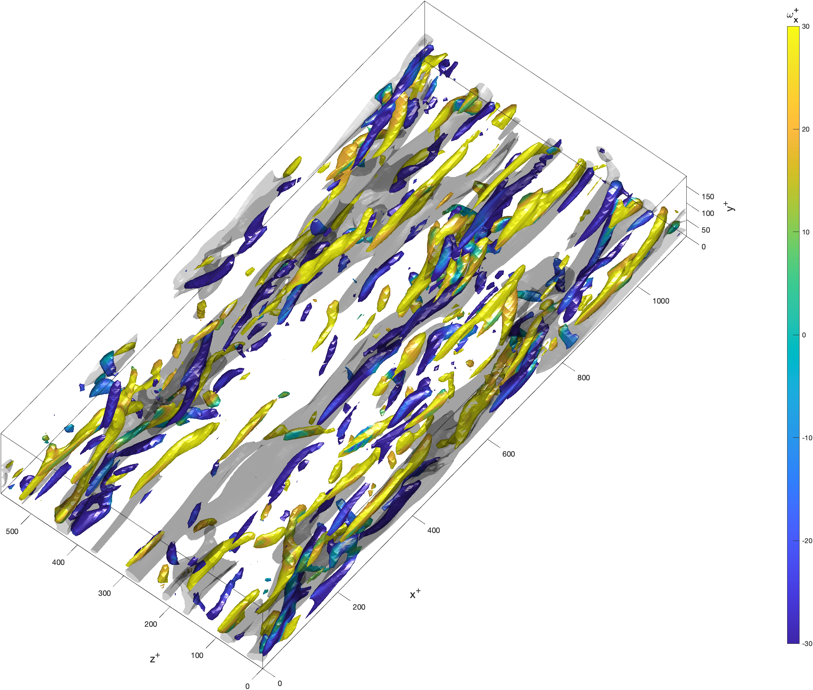
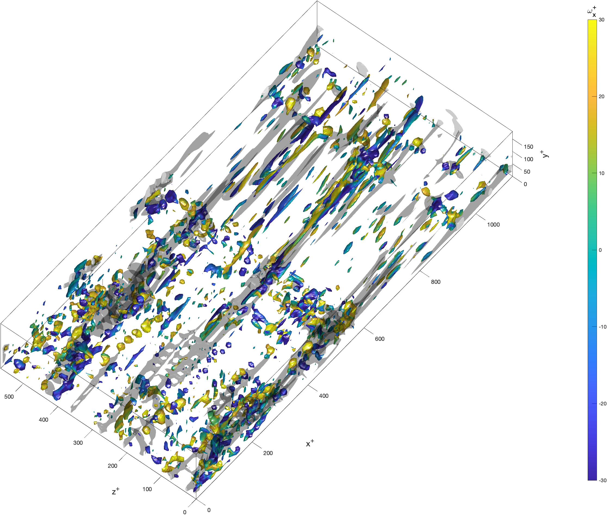
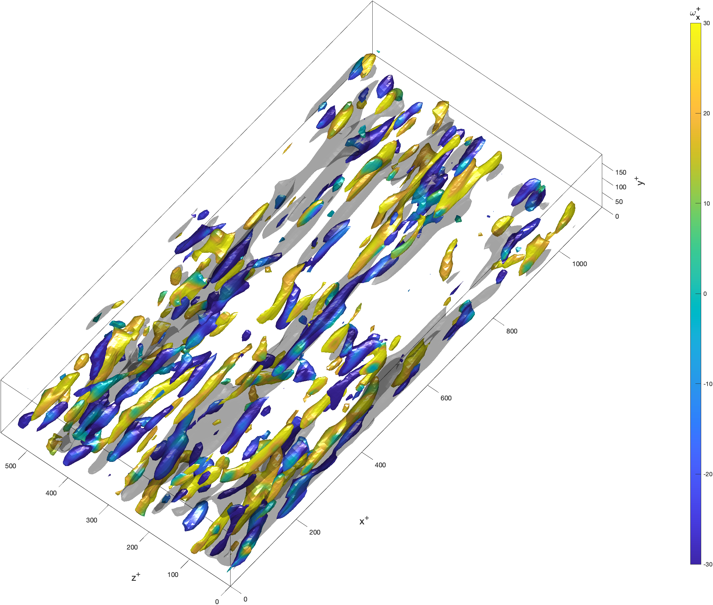

# 3D turbulent channel flow reconstruction using sparse 2D images 
PyTorch implementation and training of a convolutional autoencoder to reconstruct a 3D turbulent channel flow at Re_tau = 180 using sparse 2D splices of the 3D data.

Author: Shinya Kondo

 

## Model Architecture
The model is an autoencoder with 6 layers in total. The encoder and decoder consist of 3 convolutional layers each and contains a hyperbolic tangent activation function.

## Running the code
The python notebook provided in this repo can be run as is and will give you a step-by-step guide on creating your architecture and training your model. The data to train the model can be found and downloaded from this [google drive](https://drive.google.com/drive/folders/1po0VZIrBYIcB6bFJQ2R9_jbT_JfOz90L?usp=sharing).

The python notebook will derive the necessary dataset; however, the 3D reconstruction of the flow found below was reconstructed using the 'plotfig.m' matlab script in the repo. The image shows the vortical structures of the flow in color and the streamwise streaks in transparent grey.

Please star this repo if you use it and find it useful!

**Original Image**

**Corrupted Image**

**Reconstructed Image**

